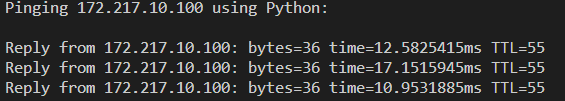
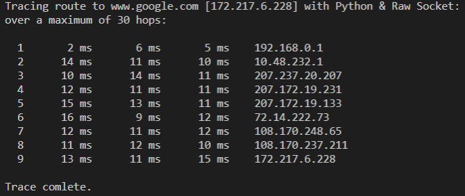

# Simple Proxy Server

📠Networking diagnostic tools (ping & traceroute) in Python

The tools are implemented with ICMP messages and raw sockets. They work by sending ICMP echo (ICMP type ‘8’) messages to the same destination with increasing value of the time-to-live (TTL) field. The routers along the traceroute path return ICMP Time Exceeded (ICMP type ‘11’ ) when the TTL field becomes zero. The final destination sends an ICMP reply (ICMP type ’0’ ) messages on receiving the ICMP echo request

The IP addresses of the routers which send replies can be extracted from the received packets. The round-trip time between the sending host and a router is determined by setting a timer at the sending host

## Usage

>  python3 .\IcmpPing.py [website]
>
>  python3 .\Traceroute.py [website]

## Sample Output

### ping

### traceroute

## License

MIT License